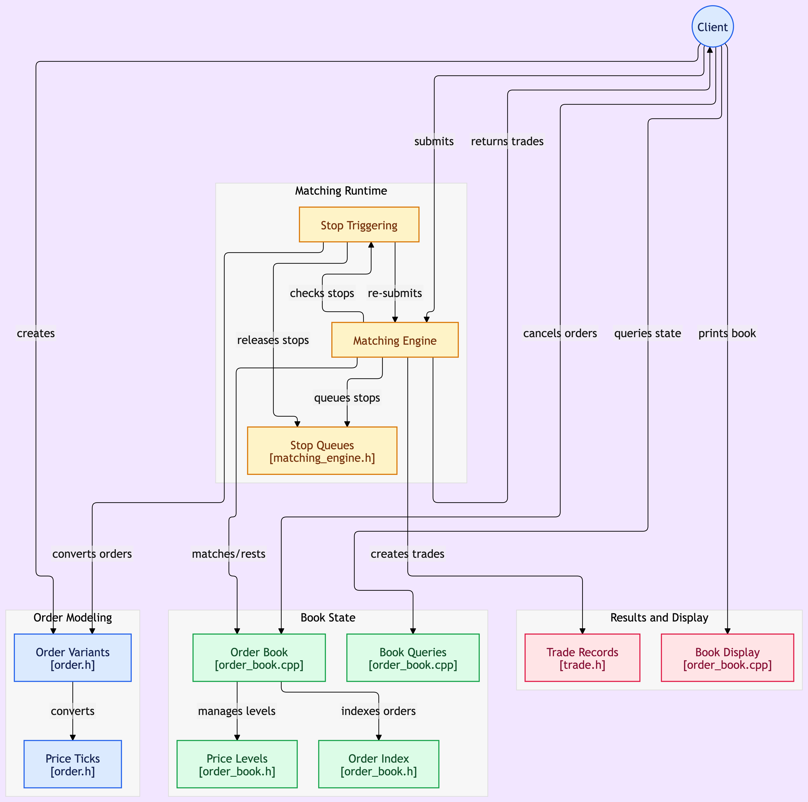

# Order Book

A C++17 limit order book and matching engine that contains price-time priority matching, fixed-point pricing, stop and stop-limit orders, and a benchmark-driven approach to the hot paths.

## Features

**Order types**: Limit, Market, Stop, Stop-Limit  
**Price-time priority matching**: FIFO fill order within each price level  
**O(1) cancellation**: cancel any resting order, at any queue position, without a scanning  
**Fixed-point pricing**: prices stored as integer ticks, no floating-point rounding drift  
**Zero-overhead order model**: value-type orders dispatched via `std::variant`/`std::visit`  
**Catch2 unit tests**: covering matching, cancellation, and stop-triggering behavior  
**Benchmarked hot paths**: used before/after times after data structures were changed in order to quantify code efficiency

## Architecture

| File | Responsibility |
|---|---|
| `include/order.h` | Contains four independent order types (`LimitOrder`, `MarketOrder`, `StopOrder`, `StopLimitOrder`) - no shared base class, no virtual dispatch. `OrderVariant = std::variant<...>` plus free functions (`id`, `side`, `quantity`, `original_qty`,`is_marketable`, `type_str`, `toString`, `fill`) that dispatch via `std::visit` |
| `include/order_book.h` / `src/order_book.cpp` | Resting-order storage: `bids_` / `asks_` (`std::map<Price, std::list<LimitOrder>>`), `order_index_` for O(1) lookup / cancel - stores `LimitOrder` by value, since it's the only type that ever rests |
| `include/matching_engine.h` / `src/matching_engine.cpp` | `submit` / `match` / `check_stops`: matching and stop-triggering logic, dispatching across `OrderVariant` via `std::visit` and the `overloaded` visitor lambda combinator |
| `include/trade.h` | `Trade` record produced by filling an order |



**Order representation**: `LimitOrder`, `MarketOrder`, `StopOrder`, and `StopLimitOrder` are independent, non-polymorphic value types. Each order type only carries the fields it actually needs (e.g. `MarketOrder` has neither a `price_` nor a `stop_price_`). `OrderVariant` is the closed set any incoming order can be; free functions in `order.h` dispatch across it via `std::visit` for operations every type shares, and the `overloaded` visitor-combinator handles the places behavior differs per type.

**Matching**: `MatchingEngine::submit` routes non-marketable orders (stops) into a dormant book, everything else into `match()`, which visits `incoming` exactly once to resolve its concrete type. The `incoming` order is filled in FIFO order against `queue.front()`, until the order is exhausted or the book is no longer marketable at the  order's limit. Any unfilled `LimitOrder` quantity rests in the book on its respective side; an unfilled `MarketOrder` quantity is dropped.

**Cancellation**: `order_index_` maps an `OrderID` directly to a `std::list<LimitOrder>::iterator` into `bids_`/`asks_` - no separate handle needed, since dereferencing the iterator gives the live order data directly (orders live in the list by value, not by a pointer reference). Cancelling is a hash lookup, an `O(log n)` price-level lookup, and a direct `list::erase(iterator)`, no scan required of the level's queue.

**Fixed-point pricing**: prices are stored as `int64_t` ticks (`PRICE_SCALE = 10,000`), converted once at order construction by using `to_ticks(double)`. Every downstream comparison and match is integer arithmetic, therefore there's no float rounding error that may compound across repeated price comparisons.

## Prerequisites
* CMake ≥ 3.15
* A C++17 compiler (developed against g++ 11+)

## Build and Run

```bash
mkdir build && cd build
cmake ..
make
```

Run the demo:
```bash
./order_book
```

### Using `clang-tidy`
```bash
clang-tidy -p build src/order_book.cpp src/matching_engine.cpp src/main.cpp
```

### Output
**Note**: this output was created using the `populate_book()` function.
```
  ORDER BOOK
       PRICE       QTY      ORD           CUM     DEPTH
  ----------------------------------------------------
    105.0000           30       3            150  
    104.0000           30       3            120  
    103.0000           30       3             90  
    102.0000           30       3             60  
    101.0000           30       3             30  
  ----------------------------------------------------
  spread 2.0000  mid 100.0000
  ----------------------------------------------------
     99.0000           30       3             30  
     98.0000           30       3             60  
     97.0000           30       3             90  
     96.0000           30       3            120  
     95.0000           30       3            150  
```

### Run the tests:
```bash
./unit_tests
```
### Output
```
Randomness seeded to: 3214156994
===============================================================================
All tests passed (17 assertions in 8 test cases)
```

## Benchmarks
```bash
./benchmark_test_1  # cancel_order: mid-queue vs tail-of-queue cancel cost
./benchmark_test_2  # price-level insert cost vs. book depth (10k / 100k / 1M Price Levels)
```

Both benchmark targets are built **without** AddressSanitizer (`unit_tests` is built with it). Mixing sanitizer tools into a nanosecond-scale benchmark proved to bury the real time under ASan's per-allocation bookkeeping.

### `cancel_order`: O(n) deque -> O(1) list

Resting orders per price level were originally a `std::deque` as an initial approach to `price-time priority`; cancelling anything that wasn't at the front or back required an `O(n)` shift. Switching to `std::list`, with the iterator into it cached in `order_index_` allows for `O(1)` lookup and cancel.

Measured on a release build, no address sanitizers, 30-trial average:  
| | Before (`deque`) | After (`list`) | Speedup |
|---|---|---|---|
| Cancel mid-queue | 0.141 ms | 0.00086 ms | **~164x** |
| Cancel tail-of-queue | 0.138 ms | 0.00082 ms | **~169x** |

### `shared_ptr<Order>` + virtual dispatch -> `std::variant`

The `Order` hierarchy (`shared_ptr<Order>` + virtual `is_marketable()`/`type_str()`) was replaced with four independent value types using `std::variant`. This removed the vtable pointer, the per-order heap allocation from `make_shared`, and every atomic `shared_ptr` refcount operation on the hot path.

First working version actually worsened match throughput (438 ns/fill, worse than the 390 ns/fill baseline). It replaced one virtual call per fill iteration with roughly seven separate `std::visit` dispatches per iteration, one for every field access on the incoming order. Fixed by visiting the incoming order exactly once per `match()` call (its type can't change mid-loop, only its quantity does).

Measured on a release build, 30-trial average, 10,000 orders:
| | Before (`shared_ptr` + virtual) | After (`variant`, visit-once) | Speedup |
|---|---|---|---|
| Order construction | 1.1951 ms | 0.547944 ms | ~54% (2.18x) |
| Match throughput | 3.90039 ms | 2.58867 ms | ~34% (1.51x) |

### Price-level lookup: 

Measured before rewriting the order representation; the `std::map` structure itself is unchanged (still `O(log n)` red-black tree) - the speedup below is caused by the cheaper order construction from switching the `shared_ptr<Order>` + virtual dispatch to `std::variant`. The number of price levels should stay small in practice, and even at 1M levels the search stayed fast enough for the scope of this project.

| Book depth | Before (`shared_ptr` + virtual) | After (`variant`) | Speedup |
|---|---|---|---|
| 10,000 | 0.00089 ms | 0.0006971 ms | ~22% |
| 100,000 | 0.00093 ms | 0.0007555 ms | ~19% |
| 1,000,000 | 0.00100 ms | 0.0008812 ms | ~12% |

The percentage shrinks as book depth grows: the construction saving is roughly fixed per insertion, while the `O(log n)` map-insert cost is increasing as the depth grows, so a fixed saving becomes a shrinking slice of a growing total.

## Testing

The Catch2 test (`tests/order_book_tests.cpp`) covers: cancelling on both sides, cancelling a nonexistent id, FIFO fill ordering within a price level, partial fills, full fills removing the resting order, a triggered `StopOrder` converting to and filling as a `MarketOrder`, and triggered buy and sell side `StopLimitOrder`s that partially fill and rest the remainder as a `LimitOrder`.

One of those assertions - checking `best_bid()` after a triggered `StopLimitOrder` caught a real bug where the trigger path was double-converting an already-tick-scaled price through a `double`-taking constructor, quietly resting orders off by a factor of `PRICE_SCALE`.

## What's Next
My future plans for this project consist of implementing an arena / contiguous-storage layer, replacing the current per-order-list-node allocation with orders stored contiguously and referenced by index-based handles instead of iterators. Implementing a monotonic sequence counter instead of a `steady_clock::now()` read per order, and closing the remaining `O(log n)` price-level lookup in `cancel_order` by caching a level iterator alongside the order iterator already in `order_index_`.

